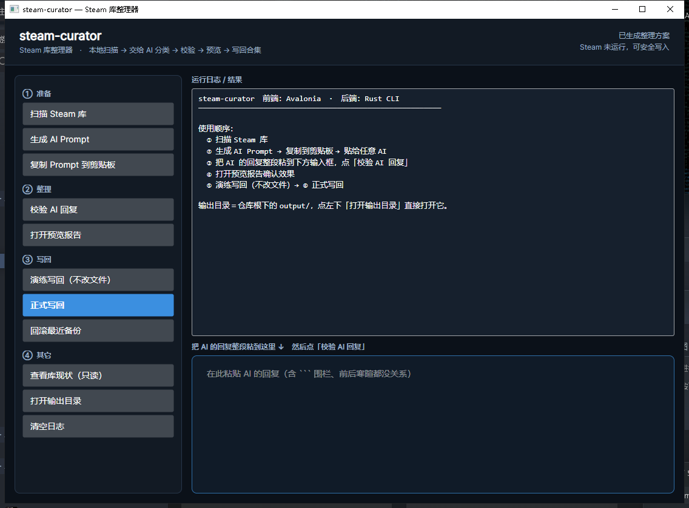

# steam-curator

> 把 Steam 库读成数据 → 交给 AI 判断怎么分类 → 校验结果 → 预览 → 写回 Steam 合集。

一个 Rust 写的工具，**命令行和图形界面都有**。核心逻辑全在 Rust 里（43 个自动化测试），
界面提供两套：**Avalonia（Fluent 外观，推荐）** 与**原生 Win32**（依赖极少，没装 .NET 时用）。
两套界面都只是壳，真正的活由同一个 CLI 干，不会出现「命令行里对、界面里不一样」。

它不联网、不调 API、不上传任何东西：
**AI 那一步由你自己完成**（把生成的 prompt 贴给任意对话式 AI，再把回复贴回来）。



```
        ┌──────────┐   library.json   ┌──────────┐   AI-PROMPT.md   ┌─────────┐
本地Steam │  scan    │ ───────────────► │  prompt  │ ───────────────► │  你/AI  │
        └──────────┘                  └──────────┘                  └────┬────┘
                                                                        │ ai-plan.json
        ┌──────────┐   plan.json      ┌──────────┐   report.html   ┌────▼────┐
Steam合集 │  apply   │ ◄─────────────── │  plan    │ ◄────────────── │ 校验清洗 │
        └──────────┘                  └──────────┘                  └─────────┘
```

## 为什么不是「AI 直接改我的库」

三个理由，也是这个工具的骨架：

1. **AI 会在 appid 上产生幻觉。** 它没见过你的库，编几个数字是常态。
   `plan` 会用真实的 appid 全集去对，凡是库里不存在的 appid 一律拦下并报告，
   而不是默默写进 Steam 让一堆合集变成空的。
2. **写 Steam 配置是有代价的操作。** 所以默认 `apply` 只**演练**，
   真要落盘得显式加 `--write`；而且每次写入前自动整份备份、一条命令回滚。
3. **AI 输出格式一定会飘。** 包 ``` 围栏、键名写成 `apps`、同名合集给两个、
   同一款游戏在一个合集里出现两次 —— 这些都在 `plan` 里被规整掉，
   每一种修复都会打印给你看。

## 构建

### 1) 后端：Rust CLI（两个界面的引擎）

需要 Rust（任意 1.74+ 版本）和一个链接器。仓库不含任何外部资源。

```bash
cargo build --release
# 产物:
#   target/release/steam-curator(.exe)      命令行版，约 940 KB
#   target/release/steam-curator-gui(.exe)  原生 Win32 界面版，约 970 KB
```

命令行版只依赖 `serde` + `serde_json`；原生界面版额外依赖 `native-windows-gui`
（Win32 控件的薄封装，只拉 `winapi` / `lazy_static` / `bitflags`）。
两者都没有 C 依赖、没有网络调用，编出来的 exe 只依赖 Windows 自带的系统 DLL，
拷到别的机器上直接能跑。

只想要命令行版、不想拉 GUI 依赖：

```bash
cargo build --release --no-default-features
```

### 2) 前端：Avalonia 界面（推荐）

需要 .NET 8 SDK。它调用上面那个 `steam-curator.exe`，所以先把后端编出来。

```bash
cd gui-avalonia
dotnet build -c Release
# 产物: gui-avalonia/bin/Release/net8.0/steam-curator-avalonia.exe

# 给没装 .NET 的机器用（自包含，约 95 MB）：
dotnet publish -c Release -r win-x64 --self-contained true
```

前端会自动向上查找 `Cargo.toml` 来定位后端 exe 与 `output/` 目录，
所以放在仓库里直接跑就行，不用配环境变量。

## 图形界面

左边一列按钮就是流水线的每一步，右边上面是运行日志、下面是**粘贴 AI 回复**的输入框
（浅蓝描边那块，加高显示，一眼能看出该往哪贴）。

界面按 Avalonia / Fluent 规范做：

- **控件外观全部交给 `FluentTheme`**，不自己重画模板 —— 圆角、悬停高亮、焦点环、
  滚动条都是主题原生的；配色只覆盖语义化资源（如 `SystemAccentColor`），
  选中态和强调色自动跟随。
- **「正式写回」是唯一强调色主按钮**，与其它操作明确区分。
- **两步确认**：第一次点只把按钮变成「⚠ 再点一次确认」，并把「Steam 必须先完全退出」
  等注意事项写进日志区；第二次点才真的写。
- **忙碌时标题栏出现不定量进度条**，不再只有静止文字。
- 「打开输出目录」「查看库现状」「清空日志」放在最下面一组。

原生 Win32 版（`steam-curator-gui.exe`）保留着：依赖极少，在没装 .NET 的机器上仍可用。
界面朴素但功能完全相同 —— 两者调用的是**同一批函数**（`steam_curator::session`）。

### Windows 上用 GNU 工具链

如果本机没装 MSVC：

```powershell
# 1) Rust（GNU host，minimal profile）
Invoke-WebRequest 'https://static.rust-lang.org/rustup/dist/x86_64-pc-windows-gnu/rustup-init.exe' -OutFile "$env:TEMP\rustup-init.exe"
& "$env:TEMP\rustup-init.exe" -y --default-host x86_64-pc-windows-gnu --profile minimal

# 2) MinGW 链接器
winget install --id BrechtSanders.WinLibs.POSIX.UCRT -e
```

## 快速开始

图形界面：启动 `steam-curator-avalonia.exe`（推荐）或 `steam-curator-gui.exe`，
按左边按钮 ①②③④ 四组一路点下去 —— 先「扫描 Steam 库」，再「生成 AI Prompt」并复制，
贴给 AI 之后把回复粘到右下那块蓝色描边的框里，点「校验 AI 回复」。
**「正式写回」要连点两次**，第一次只是提醒你退出 Steam。

命令行的：

```bash
steam-curator all                 # 扫描 + 生成 prompt（写到 ./output/）
# → 打开 output/AI-PROMPT.md，整份贴给 AI，把回复存成 output/ai-plan.json
steam-curator plan                # 校验 AI 结果，生成 plan.json + report.html
steam-curator preview --open      # 打开预览报告，先看效果再决定要不要写
steam-curator apply               # 演练：只打印将会怎么做
steam-curator apply --write       # 落盘（先完全退出 Steam！）
steam-curator restore --latest    # 后悔了：回滚
```

## 命令

| 命令 | 作用 | 主要产物 |
|---|---|---|
| `scan` | 扫描本地 Steam 库 | `library.json`、`library.csv` |
| `prompt` | 生成给 AI 的 prompt | `AI-PROMPT.md` |
| `plan` | 导入 AI 回复并校验清洗 | `plan.json`、`report.html` |
| `preview` | 生成自包含 HTML 预览 | `report.html` |
| `apply` | 写回 Steam 合集（默认演练） | 改 Steam 文件 + `apply-report.json` |
| `restore` | 从备份回滚 | 还原 Steam 文件 |
| `inspect` | 只读查看库与合集概况 | 无 |
| `all` | `scan` + `prompt` | 同 scan/prompt |

通用选项：`-o/--out <目录>`、`-s/--steam-dir <目录>`、`-u/--user <ID>`。

`scan` 专属：`--installed-only`（只看已安装的，跳过 45 MB 的 `appinfo.vdf`）、`--no-csv`。
`prompt` 专属：`--max-games <N>`（游戏表最多列 N 行，**未归档的优先**）、
`--no-json`、`--mode fresh|extend`、`--lang zh|en`。

库很大时 prompt 会自动瘦身：超过 200 款游戏就不再附第二遍的紧凑 JSON，
并在日志里说明原因。本机 2031 款时全量约 242 KB（≈8 万 token），
加 `--max-games 500` 后降到约 104 KB。

完整选项见 `steam-curator help`。

## 数据从哪来

全部是 Steam 官方写入的本地文件，只读不改（除了 `apply`）：

| 数据 | 来源 |
|---|---|
| 库根列表 | `steamapps/libraryfolders.vdf` |
| 已安装游戏、体积、语言、最后更新 | `<库>/steamapps/appmanifest_<appid>.acf` |
| **已安装 + 已拥有未安装**的 appid 全集 | `userdata/<steam3>/config/librarycache/*.json` 的文件名，以及现有合集的成员 |
| **未安装游戏的名称** | `appcache/appinfo.vdf`（二进制 KeyValues，只读解析） |
| 游玩时长、最后游玩时间 | `userdata/<steam3>/config/localconfig.vdf` |
| 现有合集（权威） | `userdata/<steam3>/config/cloudstorage/cloud-storage-namespace-1.json` |
| 账号 | `config/loginusers.vdf` |

细节与实测坑位记录在 [docs/STEAM-FORMATS.md](docs/STEAM-FORMATS.md)。

### 扫描范围：整个库，不只是装了的

`appmanifest` 只覆盖**已安装**的游戏，但真实的库里大部分游戏并没装。
`librarycache` 里有「被 Steam 记住的全部 appid」，却没有游戏名 —— 名字只能去
`appcache/appinfo.vdf` 里取。这个解析器是实测逆向出来的：

- 本机实测：**19423** 条记录、**19361** 条能解出名字、字符串表 **42435** 条
- 与 `appmanifest` 的 35 个已安装游戏名逐条比对 **35/35 一致**
- 两套互不参考的独立实现（Rust 与 Python）关键数字完全吻合
- 真机结果：**2031 款**游戏全部拿到（已安装 34 + 已拥有未安装 1997），
  名字解析成功率 **99.61%**，耗时约 1.3 秒

`appinfo.vdf` 会被运行中的 Steam **就地重写**，所以读不动时**只降级不中断**：
退回「只统计已安装的游戏」并给出可读告警。

不想读这个 45 MB 的文件时：`steam-curator scan --installed-only`。

## 安全边界

写入前会逐条检查，任何一条不满足都拒绝动手：

- **Steam 正在运行时拒绝写入**（可用 `--force` 跳过，但你会丢改动：Steam 退出时会用
  内存里的状态覆盖这个文件）。
- **默认演练**，不加 `--write` 绝不碰任何文件。
- **写前整份备份**到 `output/backups/<时间戳>/`，含合集文件、命名空间版本文件、
  `localconfig.vdf`，以及一份记录「备份文件 → 原始绝对路径」的映射，
  所以 `restore` 不依赖任何猜测。
- **只动自己的东西**：`showcases.*`、`NewContentRollup_*`、删除标记（tombstone）、
  别的命名空间条目全部原样保留，只重排为紧凑格式。
- **不碰动态合集**（带 `filterSpec`、由过滤器实时生成的）和系统合集
  （`favorite`、`hidden`）。
- **幂等**：结果与现状一致时不改版本号，重复执行不会反复抬版本。
- **不会卸载任何游戏。** 报告里的「吃灰候选」只是提示。

## 归档策略：merge 还是 replace

默认 `merge` —— 已有同名合集时，**保留原有成员**，把新成员并进去。
这是保守选择：AI 偶尔漏掉几款游戏时，你不会因此丢掉之前手工整理的结果。
报告里会明确写出「保留原有 N 款」。

想以方案为准则用 `--replace`，被移除的游戏会在报告中列出。

`--prune` 用于清理：删除**本工具此前创建**、但当前方案里已经不存在的合集
（靠 `output/state.json` 精确识别，不会误删你自己建的合集）。

## 会生成什么

```
output/
├── library.json          扫描结果（结构化，含派生分析位）
├── library.csv           同上，表格版，方便丢进 Excel
├── AI-PROMPT.md          给 AI 的 prompt（含数据表 + 输出契约）
├── ai-plan.json          ← 你放 AI 回复的地方
├── plan.json             校验清洗后的整理方案
├── apply-report.json     最近一次写入演练/执行的结果
├── report.html           自包含预览报告（断网可看）
├── state.json            本工具管理过的合集记录（供 --prune 精确清理）
└── backups/<时间戳>/     每次写入前的完整备份
```

`output/` 已在 `.gitignore` 里 —— 里面有你的个人库数据，别提交。

## 预览报告里有什么

- 库概览统计卡（体积、时长、从未启动、沉寂、未归档）
- 写回预览：每个合集是新建/更新/无变化/删除，以及新增、保留、移除各多少
- 整理方案：合集卡片，含成员、时长、体积，未启动的游戏单独标色
- 校验结果：AI 幻觉 appid、重复项、未归档游戏等，按 info/warn/error 分级
- 数据洞察：占盘大户 Top15、时长 Top15、吃灰候选清单
- Steam 现有合集对照
- 全部游戏表（带即时搜索框）
- 扫描告警

## 常见问题

**找不到 Steam / 扫不到游戏？**
用 `-s "D:\Steam"` 显式指定；`steam-curator inspect` 会打印它实际用了哪个路径。

**提示「找不到合集文件」？**
`cloud-storage-namespace-1.json` 由 Steam 客户端在首次进入「库」界面时创建。
先启动一次 Steam 再看。

**写了但 Steam 里没变化？**
确认写入时 Steam 是**完全退出**的（含托盘图标），然后再启动 Steam。
若仍未生效，`steam-curator restore --latest` 回滚，并到 issue 里附上
`apply-report.json`。

**多个账号？**
`steam-curator inspect` 列不出来时用 `-u <steam3>` 指定，默认取最近登录的账号。

**能用在 Linux / Steam Deck 吗？**
代码里除「定位 Steam 根目录」（Windows 走注册表）和「时区偏移」（Windows 读注册表）
之外都是跨平台的。Linux 上可以用 `-s ~/.steam/steam` 绕开第一条；
时区会退回 UTC。尚未在 Linux 上实测。

## 许可

MIT，见 [LICENSE](LICENSE)。
